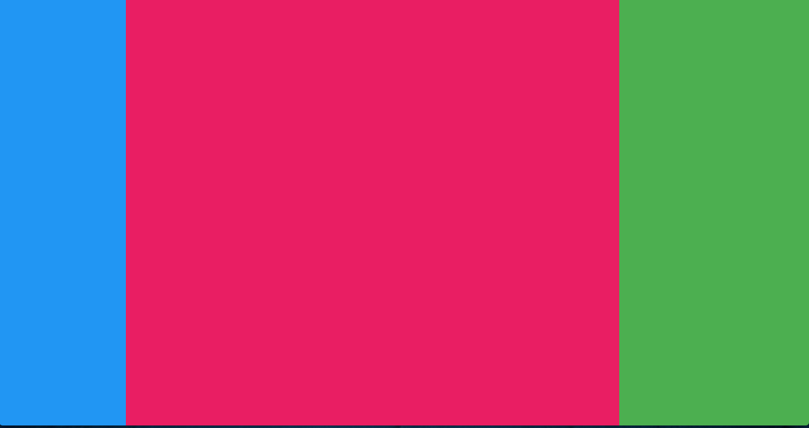
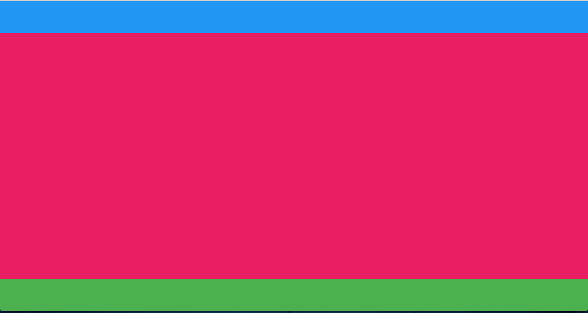
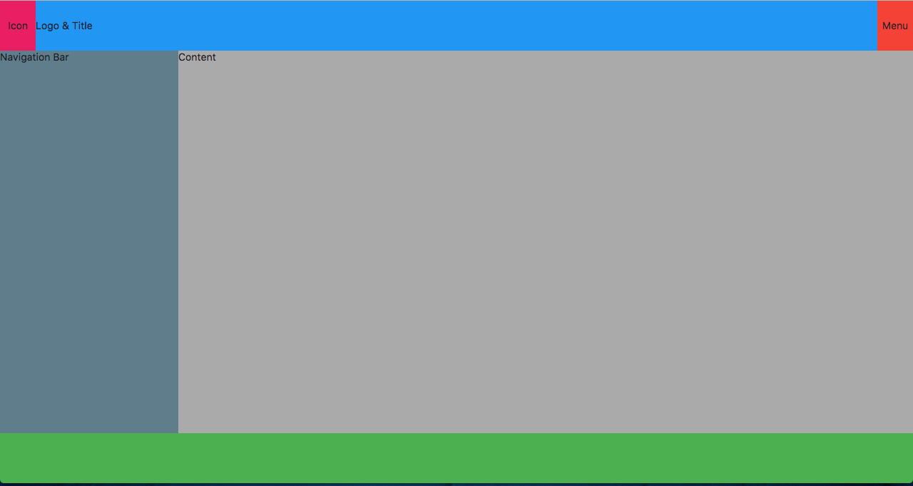

# Veenbox 2.0

Veenbox provides common components for React and ReactNative to build Layouts

# List of Exposed Components

- Flexbox
- RootContainer
- Panel
- PanelItem
- Strip
- StripItem


`RootContainer` is Root for Applicaton should be used 
once

`Flexbox`  is root lower level implementation

`Panel` -> Vertical Panels

`Strip` -> Horizontal Strips


# Installation

```
    yarn add veenbox

    or

    npm install --save veenbox
```

`

    import {Flexbox,RootContainer, Panel,PanelItem, Strip, StripItem} from 'veenbox'
`


# Demo 1


```
import React, { Component } from 'react';
import {RootContainer, Panel,PanelItem, Strip, StripItem} from 'veenbox'


const getBGColorCss =(color)=>{
    return {
        backgroundColor:color
    }
}

const Demo1 = ()=>(
    <RootContainer>
        <Strip>
            <StripItem size={200} style={getBGColorCss('#2196f3')}></StripItem>                
            <StripItem style={getBGColorCss('#e91e63')}></StripItem>                
            <StripItem size={300} style={getBGColorCss('#4caf50')}></StripItem>                
        </Strip>
    </RootContainer>
)

export default Demo1;
```



```
const getBGColorCss =(color)=>{
    return {
        backgroundColor:color
    }
}

const Demo2 = ()=>(
    <RootContainer>
        <Panel>
            <PanelItem size={70} style={getBGColorCss('#2196f3')}></PanelItem>                
            <PanelItem style={getBGColorCss('#e91e63')}></PanelItem>                
            <PanelItem size={70} style={getBGColorCss('#4caf50')}></PanelItem>                
        </Panel>
    </RootContainer>
)

export default Demo2;
```



```
const getBGColorCss =(color)=>{
    return {
        backgroundColor:color
    }
}

const Demo3 = ()=>(
    <RootContainer>
        <Panel>
            <PanelItem size={70} style={getBGColorCss('#2196f3')}>
                <Strip>
                    <StripItem centerAll size={50} style={getBGColorCss('#e91e63')}>Icon</StripItem>
                    <StripItem crossAlign="center" style={getBGColorCss('#2196f3')}>Logo & Title</StripItem>
                    <StripItem centerAll size={50} style={getBGColorCss('#f44336')}>Menu</StripItem>
                </Strip>
            </PanelItem>                
            <PanelItem style={getBGColorCss('#e91e63')}>
                <Strip>
                    <StripItem size={250} style={getBGColorCss('#607d8b')}>Navigation Bar</StripItem>
                    <StripItem style={getBGColorCss('#aaa')}>Content</StripItem>
                </Strip>
            </PanelItem>                
            <PanelItem size={70} style={getBGColorCss('#4caf50')}></PanelItem>                
        </Panel>
    </RootContainer>
)
```

